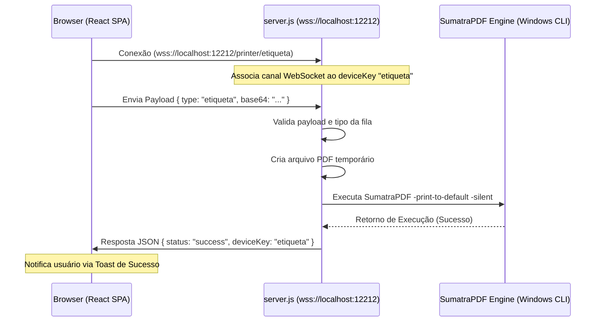

# NEXUS PRINT CONNECTOR (BRIDGE LOCAL)
> **Serviço Local de Impressão Silenciosa e Criptografada**  
> *Implementação Oficial - Nexus Intelligence (v4)*

O **Nexus Print Connector** é um microserviço local que conecta a plataforma web do SaaS Nexus diretamente com as impressoras térmicas físicas de etiquetas e notas fiscais instaladas na máquina do cliente. Ele age em segundo plano, ouvindo conexões WebSocket Seguras (`wss://`) e executando impressões silenciosas instantaneamente.

---

## 🚀 Como Executar em Desenvolvimento

### Requisitos Pró-Requisitos
*   **Node.js**: Versão 18 ou superior.
*   **Ambiente Windows**: Para execução da impressão física real.
*   **Ambiente Linux/macOS**: Habilita automaticamente o **Modo Simulação** (perfeito para testar fluxos de integração sem impressora física).

### Instruções Rápidas de Inicialização
1. Abra a pasta `nexus-print-bridge` no terminal.
2. Instale as dependências:
   ```bash
   npm install
   ```
3. Inicialize o servidor em modo de desenvolvimento:
   ```bash
   npm start
   ```
4. O conector estará rodando e escutando conexões em:  
   👉 `wss://localhost:12212`

---

## 🛠️ Compilação e Empacotamento (.exe)

O conector é empacotado em um único arquivo binário `.exe` para que o cliente final não precise instalar o Node.js. 

Para compilar o binário oficial para Windows x64:
```bash
npm run build
```

*Nota: O script de build executa automaticamente o passo `prebuild`, que limpa chaves privadas e certificados (`*.pem`) gerados em testes locais na pasta `dist/` e no diretório raiz, garantindo a distribuição segura de novas instalações.*

---

## 🖥️ Modo Simulação Cruzada (Linux/VPS)

Se você inicializar o conector em um sistema operacional que não seja o Windows (como um servidor Linux VPS), ele entrará automaticamente no **Modo Simulação**:
*   Ele não tentará extrair nem chamar o `SumatraPDF` (que é exclusivo de Windows).
*   Ao receber comandos de impressão, ele criará e apagará o PDF temporário, simulará uma fila e responderá com sucesso em 500ms.
*   Isso permite que você teste o fluxo de comunicação do webhook da plataforma em ambientes virtuais de staging/dev.

---

## 🧬 Arquitetura e Roteamento

O conector implementa isolamento lógico de múltiplos canais (impressoras) usando parâmetros dinâmicos de rota (`deviceKey`).



### Validações de Segurança Robustas:
*   **Tamanho Máximo:** Payloads Base64 com tamanho superior a 50MB são bloqueados para evitar ataques de estouro de memória (DoS).
*   **Sanitização:** Entradas de URL são validadas através da API Nativa `URL` para prevenir injeção de parâmetros maliciosos em shell de execução.
*   **Isolamento:** Se a propriedade `type` no JSON enviado for diferente do `deviceKey` da conexão atual, o servidor rejeita o comando imediatamente.

---

## 🔒 Autorização SSL no Navegador (Nomenclatura por Navegador)

Como o WebSocket seguro necessita de certificados TLS autoassinados locais, a primeira conexão exige que o usuário acesse e autorize o endereço no navegador uma única vez.

1. Acesse o painel de autorização clicando no botão da plataforma ou abrindo:  
   👉 [https://localhost:12212](https://localhost:12212)
2. **Navegadores:**
   *   **Chrome / Edge / Opera:** Clique em **"Avançado"** e depois em **"Continuar para localhost (não seguro)"**.
   *   **Firefox:** Clique em **"Avançado..."** e depois em **"Aceitar o risco e continuar"**.
   *   **Safari:** Clique em **"Mostrar Detalhes"** e confirme que confia no certificado local.
